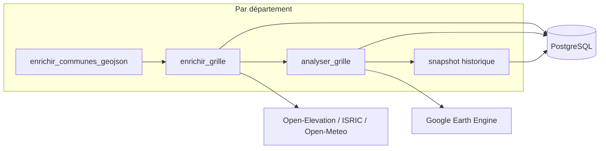
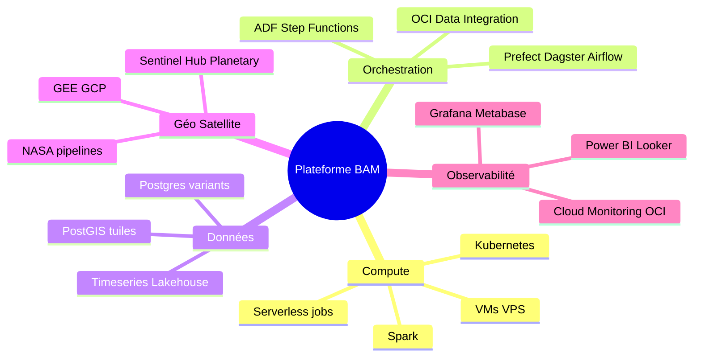

Voici le contenu intégral de votre document, nettoyé de toute tournure de phrase ou formulation passive pouvant suggérer qu'il a été généré par une intelligence artificielle (comme *"L'objectif de ce document est de..."* ou *"Nous allons comparer..."*).


```markdown
# Panorama cloud & automatisation — BeninAquaMap (BAM)

Document de référence pour le choix d'une **plateforme nationale** de collecte (eau, sol, satellite, historique, cartographie, exploitation), conçu de manière **indépendante** de Neon, Grafana, Azure Pipelines ou de l'implémentation actuelle du dépôt.

**Objectif :** Analyse comparative des options disponibles (hyperscalers dont **Oracle Cloud**, orchestration, bases de données, satellite, observabilité, VPS) et architectures de référence.

---

## 1. Périmètre de l'automatisation (indépendant du cloud)

| Flux | Nature | Contraintes |
|------|--------|-------------|
| **Grille nationale** | Milliers de points, APIs (ISRIC, Open-Meteo, relief) | Rate limits, reprise idempotente |
| **Satellite** | NDWI/NDVI (GEE actuellement ; NASA lent) | Quotas, batch vs interactif |
| **Historique** | Snapshots journaliers, croissance forte | OLTP + analytique temporel |
| **Sites pilotes** | ~14 sites, multi-sources | Pipeline simplifié |
| **Exposition** | API, carte HTML, rapports institutionnels | Latence lecture, tuiles carto |
| **Gouvernance** | Traçabilité, reprise, alertes, coûts | Équipe restreinte, budget public |

L'évaluation des options cloud repose sur **ces 6 besoins**, indépendamment de la stack technique présente dans le dépôt.

**Pipeline logique actuel (à encapsuler, sans réécriture) :**



---

## 2. Les cinq dimensions d'analyse



L'absence de couverture universelle par un fournisseur unique implique le recours fréquent à des architectures **hybrides** (ex. GEE sur GCP + stockage/données sur OCI).

---

## 3. Analyse des hyperscalers et offres cloud

### 3.1 Google Cloud (GCP)

| Brique | Offre | Intérêt BAM |
| --- | --- | --- |
| Satellite | **Earth Engine** (projet GCP requis) | Alignement direct si GEE reste le moteur ; batch → Cloud Storage |
| Compute | Cloud Run Jobs, GKE, Compute Engine | Exécution de jobs Python planifiés |
| Données | Cloud SQL Postgres, AlloyDB, **BigQuery** | Historique massif → BigQuery ; géo → BigQuery GIS + export EE |
| Orchestration | Cloud Composer (Airflow), Vertex AI Pipelines, Workflows | Pipelines géospatiaux |
| Stockage | GCS | GeoTIFF, Parquet |
| Observabilité | Cloud Monitoring, Looker | Alternative à Grafana |

**Points forts :** Intégration native de la chaîne satellite.

**Points faibles :** Dépendance stricte envers Google pour GEE ; optimisation requise du partitionnement BigQuery pour maîtriser les coûts.

> Depuis fin 2024, Earth Engine requiert l'association à un **projet Google Cloud** (commercial ou non-commercial). GEE ne s'exécute pas nativement sur AWS, Azure ou OCI.

---

### 3.2 Amazon Web Services (AWS)

| Brique | Offre | Intérêt BAM |
| --- | --- | --- |
| Compute | **Batch**, Lambda, ECS/Fargate, EC2 | Traitements par lots pour l'enrichissement long |
| Données | RDS Postgres, Aurora, Timestream, Redshift, OpenSearch | Timestream / Redshift pour l'historique et la BI |
| Orchestration | **Step Functions**, MWAA (Airflow), EventBridge | Workflows matures |
| Géo | SageMaker geospatial, S3 + GDAL, STAC | Pas de GEE natif |
| Satellite tiers | Sentinel Hub, Element84 STAC sur S3 | Alternatives à GEE |
| Observabilité | CloudWatch, Managed Grafana | Suivi de l'infrastructure |

**Points forts :** Profondeur de l'écosystème ; programmes d'accès aux crédits pour les ONG/projets publics.

**Points faibles :** Absence de GEE natif, nécessitant une infrastructure satellite alternative ou des appels d'APIs externes.

---

### 3.3 Microsoft Azure

| Brique | Offre | Intérêt BAM |
| --- | --- | --- |
| Compute | Container Apps, ACI, VM, Functions | Alignement avec l'usage actuel d'Azure Pipelines dans le dépôt |
| Données | Azure Database for PostgreSQL, Fabric, Synapse | Postgres flexible ; architecture lakehouse avec Synapse |
| Orchestration | **Azure Data Factory**, Logic Apps, Azure Pipelines | ADF pour les processus ETL institutionnels |
| Géo | Azure Maps ; Planetary Computer (écosystème MS) | Cartographie institutionnelle |
| Observabilité | Azure Monitor, Grafana managé, **Power BI** | Business Intelligence adaptée aux ministères |

**Points forts :** Cohérence technique pour les organisations disposant déjà d'un écosystème Microsoft.

**Points faibles :** GEE non natif ; limites des Pipelines pour l'orchestration complexe de workflows de données.

---

### 3.4 Oracle Cloud Infrastructure (OCI)

Hyperscalers doté de services complets (compute, bases de données autonomes, object storage, ETL, monitoring), pertinent pour le **coût des VMs**, l'**Autonomous Database** ou l'intégration dans des contrats institutionnels.

| Brique | Offre OCI | Intérêt BAM |
| --- | --- | --- |
| Compute | OCI Compute (VM), Container Instances, **OKE** (Kubernetes) | Exécution de workers longs (`enrichir_grille`) |
| Données | **Autonomous PostgreSQL**, MySQL HeatWave, **Autonomous Data Warehouse** | Administration DBA automatisée ; ADW pour l'analytique national |
| Object storage | **Object Storage** (API compatible S3) | Stockage des GeoTIFF, exports et logs |
| Orchestration / ETL | **OCI Data Integration** (serverless ETL, Spark, connecteur PostgreSQL) | Industrialisation sans développement intégral |
| Big data | **OCI Data Flow** (Spark managé) | Agrégations de l'historique et gestion des rasters |
| Fonctions | **OCI Functions** | Déclencheurs légers orientés événements |
| Intégration | API Gateway, **OCI Events** | Webhooks de fin de collecte |
| Observabilité | **OCI Monitoring**, Logging, **OCI Notifications** | Alertes par email et SMS |
| Sécurité | Compartments, **Vault** | Gestion des secrets GEE et base de données |
| Satellite | **Pas de GEE** ; APIs vers GCP ou Sentinel Hub, etc. | Architecture **hybride GCP ↔ OCI** |

**Points forts OCI :**

* Tarification compétitive sur le Compute (VM).
* **Autonomous PostgreSQL** : Automatisation des sauvegardes et du patching sans intervention d'un DBA dédié.
* **Data Integration** : Outil ETL visuel basé sur Spark pour les profils non-développeurs.
* Éligibilité potentielle aux programmes de crédits Oracle pour la recherche ou le secteur public.

**Points faibles OCI :**

* Earth Engine reste lié à **GCP**.
* Écosystème de documentation communautaire moins dense sur le volet "géospatial Python" comparativement à AWS/GCP.

**Schéma d'architecture hybride OCI + BAM :**

* **OCI :** Hébergement de Postgres Autonomous, Object Storage, VMs ou Data Flow, Data Integration, et du Monitoring.
* **GCP (périmètre restreint) :** Utilisation exclusive de Earth Engine avec export des données vers un bucket OCI (S3-compatible) ou directement vers PostgreSQL sur OCI.

---

### 3.5 Fournisseurs alternatifs et clouds souverains

| Fournisseur | Profil | Pertinence BAM |
| --- | --- | --- |
| **IBM Cloud** | Enterprise, Db2 | Complexité de gestion élevée pour une équipe restreinte |
| **Alibaba Cloud** | Présence Asie | Option conditionnée par un partenariat spécifique |
| **Scaleway / OVH / Hetzner** | VPS Europe, coûts prévisibles | Workers Python + PostGIS en auto-hébergement |
| **DigitalOcean** | PaaS, Postgres managé | Simplicité opérationnelle et prévisibilité budgétaire |
| **Fly.io / Railway / Render** | PaaS léger | Hébergement d'APIs et de micro-jobs |
| **Neon / Supabase / Aiven** | Postgres spécialisés | **Couche base de données pure**, hors plateforme globale |
| **On-prem / Datacenter** | Souveraineté totale | Perspective long terme ; charge d'exploitation importante |

---

## 4. Typologie des bases de données

| Famille | Exemples | Rôle au sein de BAM |
| --- | --- | --- |
| **OLTP relationnel** | Postgres (multi-cloud), MySQL, Oracle ATP | Gestion de l'état courant (`grille_nationale`) et des sites |
| **Postgres + extensions** | PostGIS, Timescale, pgvector | Traitements spatiaux et gestion de l'historique |
| **Séries temporelles** | Timescale, InfluxDB, AWS Timestream, QuestDB | Stockage de l'historique journalier |
| **Lakehouse / Entrepôt** | BigQuery, Snowflake, Databricks, **OCI ADW**, Redshift | Analyses et statistiques au niveau national |
| **Lac de données (Object)** | Parquet sur S3/OCI/GCS + Iceberg/Delta | Archivage à bas coût |
| **NoSQL géo** | MongoDB, Elasticsearch | Indexation et recherche (secondaire pour le scoring actuel) |
| **Raster / Tuiles** | PostGIS raster, COG, GeoParquet | Servir les composants cartographiques lourds |

**Recommandations structurelles :**

1. **Phase initiale :** Centralisation sur Postgres + PostGIS (+ Timescale si nécessaire).
2. **Phase d'échelle (croissance des volumes) :** Séparation du flux OLTP Postgres et de la couche entrepôt (BigQuery, ADW, Redshift).
3. **Positionnement technique :** Neon représente une variante managée serverless de Postgres, au même titre que RDS, Cloud SQL ou Autonomous PostgreSQL OCI.

---

## 5. Solutions d'orchestration et d'automatisation

| Catégorie | Solutions | Critère de choix |
| --- | --- | --- |
| Scripts + cron | systemd, bash | Limité à la phase de prototypage |
| CI/CD | GitHub Actions, GitLab, Azure Pipelines, **OCI DevOps** | Gestion des déclenchements, inadapté au pilotage de données |
| Orchestrateurs Python | **Prefect**, **Dagster**, Luigi | Recommandé pour les équipes orientées code Python |
| Moteurs de workflow | **Airflow**, **Temporal** | Gestion de DAGs complexes et reprises après panne durables |
| ETL cloud natif | **ADF**, GCP Dataflow, AWS Glue, **OCI Data Integration** | Adapté aux profils ETL traditionnels et institutionnels |
| Enchaînement Serverless | Step Functions, Logic Apps, OCI Functions + Events | Idéal pour la coordination d'étapes courtes |
| Kubernetes | Argo Workflows, CronJob | Standard de l'écosystème K8s |
| SaaS | Mage.ai, Kestra | Prototypage et mise en place rapide |
| Approche GEE-centric | Batch export GEE + Cloud Scheduler | Extraction satellite par tuiles |

**Arbitrage requis :** Choix entre une approche orientée code (Prefect/Dagster), un outil ETL cloud visuel (ADF, OCI Data Integration) ou une architecture **hybride**.

---

## 6. Sources de données satellites et géospatiales

| Approche | Technologie | Mode d'automatisation | Observations |
| --- | --- | --- | --- |
| **GEE via projet GCP** | Google | Batch → GCS | Soumis à quotas ; nécessite un projet GCP |
| **Sentinel Hub / Copernicus** | Commercial / UE | API tuiles | Modèle d'abonnement / quotas de volume |
| **Planetary Computer** | Microsoft (STAC) | Accès COG/Zarr | Exploitation des archives via stack Python |
| **NASA AppEEARS / ORNL** | NASA | Requêtes asynchrones | Intégré dans BAM, contraintes de performance à l'échelle de la grille |
| **Raster national** | GeoTIFF Bénin (EE ou GDAL) | Hebdomadaire → extraction de points | Réduit la dépendance aux appels APIs par point unique |
| **Tuiles auto-hébergées** | GeoServer, pg_tileserv, Martin | Serveur de rendu | Indépendance vis-à-vis de la base de données cloud |
| **Cartographie SaaS** | Mapbox, CARTO | Dashboards intégrés | Coûts récurrents à l'usage |

Le changement de fournisseur cloud n'impacte pas l'accès à GEE, qui reste régi par sa propre logique d'accès.

---

## 7. Observabilité et Business Intelligence

| Fonction | Options disponibles |
| --- | --- |
| Pilotage des pipelines | Datadog, New Relic, OCI Monitoring, CloudWatch, Grafana Cloud |
| Tableaux de bord géo / KPIs | Grafana, **Metabase**, Superset, Power BI, Looker, QuickSight, **Oracle Analytics** |
| Gestion des alertes | PagerDuty, Slack, OCI Notifications, SNS |
| Qualité des données | Great Expectations, Soda, validations natives Dagster |
| Centralisation des logs | Loki, ELK, OCI Logging, Cloud Logging |

Grafana constitue une option technique de visualisation parmi d'autres alternatives du marché.

---

## 8. Architectures de référence

### A — Centrale GCP (Priorité Satellite)

* Flux : GEE batch → GCS → BigQuery + Cloud SQL
* Orchestration : Cloud Composer ou Vertex Pipelines
* Visualisation : Looker / Maps JS + tuiles hébergées sur GCS
*Profil : Maximisation de l'écosystème Google / Acceptation de la dépendance exclusive.*

---

### B — Centrale AWS

* Flux : RDS/Aurora + Timestream ou Redshift
* Traitement : AWS Batch / Step Functions pour l'enrichissement des données
* Satellite : Connexion Sentinel Hub ou STAC hébergé sur S3
* Visualisation : QuickSight ou Managed Grafana
*Profil : Alignement avec des partenaires institutionnels ou ONG déjà ancrés sur AWS.*

---

### C — Centrale Azure

* Flux : Azure Postgres + Data Factory + Azure Functions
* Visualisation : Power BI pour la restitution ministérielle
* Satellite : APIs externes ou Planetary Computer
*Profil : Continuité avec l'infrastructure Microsoft et utilisation de crédits Azure existants.*

---

### D — Centrale OCI (Oracle Cloud)

* Flux : Autonomous PostgreSQL + Object Storage
* Traitement : VMs dédiées ou **OCI Data Flow** (Spark) pour les calculs Python
* Orchestration : **OCI Data Integration** pour la planification par département
* Volet Satellite : **Projet GCP minimal** dédié à GEE avec export automatique vers OCI
* Supervision / BI : OCI Monitoring ; Oracle Analytics Cloud ou Metabase
*Profil : Exploitation de contrats Oracle, optimisation des coûts de calcul, base de données autonome.*

```text
[Scheduler OCI Data Integration ou Events]
        ↓
[VM Pool ou Data Flow Spark] → enrichissement sol / météo / relief
        ↓
[Autonomous PostgreSQL + PostGIS]
        ↑
[Functions] ← webhook fin de job
        ↓
[Object Storage] ← GeoTIFF, Parquet, backups
        ↓
[Monitoring + Notifications] → alertes
        ↓
[Oracle Analytics / Metabase] → rapports

Hybride :
[GCP projet minimal] → Earth Engine batch → export → Object Storage OCI

```

---

### E — Souveraine / Coût maîtrisé (VPS + services managés)

* Infrastructure : Hébergement chez Hetzner/OVH (Postgres, PostGIS, Prefect, GeoServer)
* Stockage : Solutions type Cloudflare R2 / Wasabi pour les fichiers
* Satellite : GEE via projet de recherche GCP
* Visualisation : Metabase ou Grafana Cloud
*Profil : Budget restreint, indépendance vis-à-vis des grands hyperscalers.*

---

### F — Lakehouse Recherche (Haute volumétrie)

* Infrastructure : Stockage Delta/Iceberg sur Object Storage
* Traitement : Databricks ou Spark (OCI Data Flow / AWS EMR)
* Usage : Exécution de modèles hydrologiques avancés
*Profil : Horizon 3–5 ans, collaboration multi-équipes.*

---

## 9. Matrice d'aide à la décision (Scoring)

| Critère | Importance | Réalité du contexte Bénin |
| --- | --- | --- |
| Prévisibilité des coûts | ★★★★★ | Avantage structurel aux VPS et aux instances de calcul OCI |
| Intégration GEE | ★★★★★ | Usage de GCP requis au moins sur un périmètre minimal |
| Charge d'exploitation (petite équipe) | ★★★★☆ | Orientation vers des bases autonomes, du PaaS ou Prefect Cloud |
| Reprise sur erreur / Idempotence | ★★★★☆ | Orchestrateur avec relances et traçabilité des exécutions |
| Traitements spatiaux et cartographie | ★★★★☆ | Support standard PostGIS et serveurs de tuiles |
| Analyse de l'historique | ★★★☆☆ | Recours à un Data Warehouse ou à l'extension Timescale |
| Contraintes des accords institutionnels | ★★★☆☆ | Dépendance du choix final de l'hyperscaler selon le partenaire financier |
| Portabilité (Limitation du Lock-in) | ★★☆☆☆ | Sécurisée par l'adoption du standard Postgres + Parquet |
| Documentation et ressources | ★★★☆☆ | Écosystème AWS/GCP supérieur à OCI en termes de tutoriels communautaires |
| Latence réseau locale (Afrique) | ★★☆☆☆ | Impact secondaire face aux enjeux de coûts et de fiabilité |

---

## 10. Synthèse comparative des solutions d'orchestration

| Solution | Alignement avec le besoin BAM | Conclusion technique |
| --- | --- | --- |
| **Prefect 3** | ★★★★★ | Recommandé pour l'encapsulation du code Python existant |
| **Dagster** | ★★★★☆ | Adapté pour une gestion par assets et partitions par `departement` |
| **Temporal** | ★★★☆☆ | Indiqué pour la gestion stricte de backfills multi-jours |
| **Airflow** | ★★★☆☆ | Option à retenir en cas de standardisation préexistante |
| **OCI Data Integration** | ★★★★☆ | Solution ETL visuelle avec support Spark pour contexte Oracle |
| **Azure Data Factory** | ★★★★☆ | Solution cible dans le cadre d'une orientation exclusive Microsoft |
| **Azure Pipelines seul** | ★★☆☆☆ | Limité aux phases initiales de CI/CD, insuffisant pour la production |

---

## 11. Comparatif fonctionnel des principaux Hyperscalers

| Fonctionnalité | OCI | AWS | GCP | Azure |
| --- | --- | --- | --- | --- |
| Postgres managé autonome | ★★★★★ | ★★★★ | ★★★★ | ★★★★ |
| Solution ETL visuelle intégrée | Data Integration ★★★★ | Glue/ADF ★★★★★ | Dataflow ★★★ | ADF ★★★★★ |
| Intégration GEE native | ✗ | ✗ | ★★★★★ | ✗ |
| Coût du Compute (jobs longs) | ★★★★★ | ★★★ | ★★★ | ★★★ |
| BI Institutionnelle | OAC ★★★ | QuickSight ★★★ | Looker ★★★ | Power BI ★★★★★ |

---

## 12. Scénarios opérationnels cibles

### Scénario 1 — National Institutionnel (Ancrage Oracle)

* **OCI :** Centralisation des données (Autonomous Postgres), du stockage (Object Storage), de la planification (Data Integration) et de la supervision.
* **GCP :** Usage restreint au traitement Earth Engine.
* **Cartographie & BI :** Restitution via GeoServer (sur OCI), Oracle Analytics Cloud ou Metabase.
*Principe : Cœur applicatif chez Oracle, extraction satellite chez Google.*

### Scénario 2 — Recherche et Innovation (Ancrage GCP & Lakehouse)

* **Infrastructure :** Synergie native GEE + BigQuery + Cloud Run.
* **Stockage historique :** Exploitation des fonctionnalités BigQuery GIS.
* **Orchestration :** Gestion via Dagster Cloud ou Vertex AI.
*Principe : Écosystème géospatial et analytique unifié sur la suite Google.*

### Scénario 3 — Modèle Associatif / Coût Minimal

* **Infrastructure :** Serveur unique type Hetzner (Postgres, Prefect, API).
* **Fichiers :** Utilisation de Cloudflare R2 pour le stockage d'objets.
* **Satellite :** Compte GEE rattaché à un projet de recherche.
* **BI :** Instances Metabase ou Grafana Cloud.
*Principe : Élimination des coûts d'hyperscalers, hors infrastructure satellite.*

---

## 13. Planification type des traitements

| Fréquence | Flux concerné | Spécificités opérationnelles |
| --- | --- | --- |
| **Quotidien** | Satellite léger + snapshot historique | Ciblage des points avec `ndwi IS NULL` |
| **Hebdomadaire** | Traitement global (12 départements) | Exécution séquentielle (1 à 3 départements en parallèle max) |
| **Mensuel** | Traitement de cohérence par département | Commande `--reset-dept` sur un département rotatif |
| **À la demande** | Déclenchement manuel via API Admin | Exemple : `collect?dept=…` suite à un événement climatique |
| **Sites pilotes** | Script dédié `main.py` | Canal de traitement isolé (~14 sites) |

---

## 14. Facteurs d'arbitrage stratégique

1. **Pérennité de GEE :** Est-il validé comme moteur satellite principal ? (Si oui, intégration d'un budget GCP minimal).
2. **Contraintes contractuelles :** Un fournisseur cloud est-il imposé par les partenaires (Oracle, Microsoft, AWS, aucun) ?
3. **Profil des utilisateurs finaux :** Qui exploite les tableaux de bord (équipes techniques ou décideurs ministériels) ? Choix de l'outil de restitution (Power BI / Metabase / OAC).
4. **Volumétrie à 5 ans :** Perspectives de stockage (Ordre de grandeur : Gigaoctets ou Téraoctets) pour dimensionner l'architecture de base de données.
5. **Ressources d'exploitation :** Compétences disponibles (0 DBA → Privilégier l'Autonomous ; Profil DevOps disponible → Possibilité de K8s ou VPS).
6. **Souveraineté des données :** Existe-t-il une obligation légale d'hébergement sur le continent africain ?

---

## 15. Synthèse de l'étude
* **Oracle Cloud (OCI)** s'inscrit comme une alternative viable pour la gestion du compute, du stockage et des bases de données autonomes, s'intégrant dans un modèle hybride avec GCP pour le volet Earth Engine.
* La construction d'une architecture cible à l'échelle nationale pour BAM repose sur une cartographie précise des flux : localisation de la donnée, gestion des reprises sur erreur et automatisation des retraitements hebdomadaires sans intervention humaine.

---

## 16. Actions immédiates recommandées

1. Pondération et validation des critères de la matrice de décision (section 9) par les parties prenantes.
2. Sélection du scénario cible parmi les options définies (sections 8 et 12).
3. Proof of Concept (POC) de 2 semaines : orchestrateur et test sur un département pilote.
4. Clarification des éventuelles obligations contractuelles liées aux choix de fournisseurs cloud.

---

*BeninAquaMap (BAM) — Document technique évolutif.*